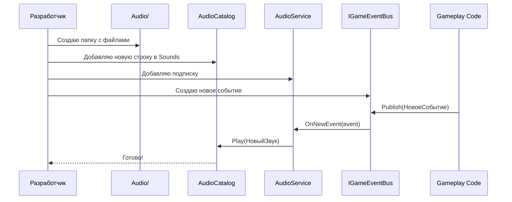
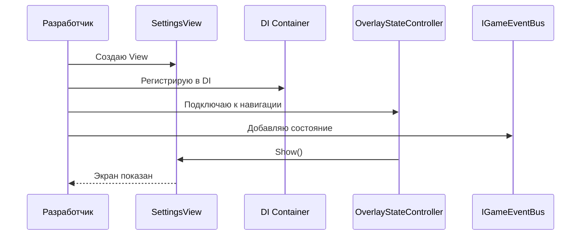

# 📊 ДИАГРАММЫ И МЕТРИКИ — ПРАКТИКА

---

## 📈 Метрики практики

| Метрика | Значение | Описание |
|---------|----------|----------|
| Шаблонов кода | 15+ | Готовые примеры |
| Антипаттернов | 15+ | Чего НЕ делать |
| Чек-листов | 4 | По дням |
| Примеров | 20+ | Пошаговые инструкции |

---

## 🏗️ Итоговая диаграмма архитектуры проекта

```mermaid
graph TB
    subgraph "Unity Scenes"
        Root[Root.unity]
        Game[Game.unity]
    end
    
    subgraph "Startup"
        Startup[Startup.cs]
        RootScope[RootLifetimeScope]
    end
    
    subgraph "Core"
        GameDirector[GameDirector]
        EventBus[IGameEventBus]
        AudioMgr[IAudioManager]
        Nav[NavigationState]
    end
    
    subgraph "Gameplay"
        Ball[BallMotion]
        Match[MatchFlow]
        Defender[DefenderLogic]
        Combo[ComboScoreService]
    end
    
    subgraph "Audio"
        AudioSvc[AudioService]
        AudioManager[AudioManager]
        AudioCat[AudioCatalog]
    end
    
    subgraph "UI"
        HUD[HUD Widget]
        Menu[MainMenu Widget]
        Pause[Pause Widget]
    end
    
    Root --> Startup
    Startup --> RootScope
    RootScope --> GameDirector
    RootScope --> EventBus
    RootScope --> AudioMgr
    
    GameDirector --> Nav
    GameDirector --> AudioMgr
    
    Ball --> EventBus
    Match --> EventBus
    Defender --> EventBus
    Combo --> EventBus
    
    EventBus --> AudioSvc
    AudioSvc --> AudioManager
    AudioManager --> AudioCat
    
    EventBus --> HUD
    EventBus --> Menu
    EventBus --> Pause
    
    style Root fill:#FFE4B5
    style Game fill:#FFE4B5
    style GameDirector fill:#90EE90
    style EventBus fill:#87CEEB
    style AudioMgr fill:#FFB6C1
    style AudioSvc fill:#90EE90
    style AudioManager fill:#87CEEB
```

---

## 🔄 Диаграмма добавления нового звука



---

## 🔄 Диаграмма добавления новой UI-страницы



---

## 📊 Метрики практики

| Метрика | Значение | Описание |
|---------|----------|----------|
| Шаблонов кода | 15+ | Готовые примеры |
| Антипаттернов | 15+ | Чего НЕ делать |
| Чек-листов | 4 | По дням |
| Примеров | 20+ | Пошаговые инструкции |

---

*← [[06_Практика/06_Практика]] | [[99_Справочник|→ Справочник]]*
